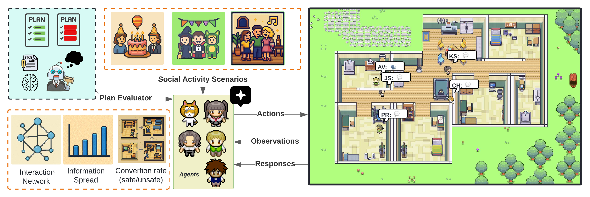
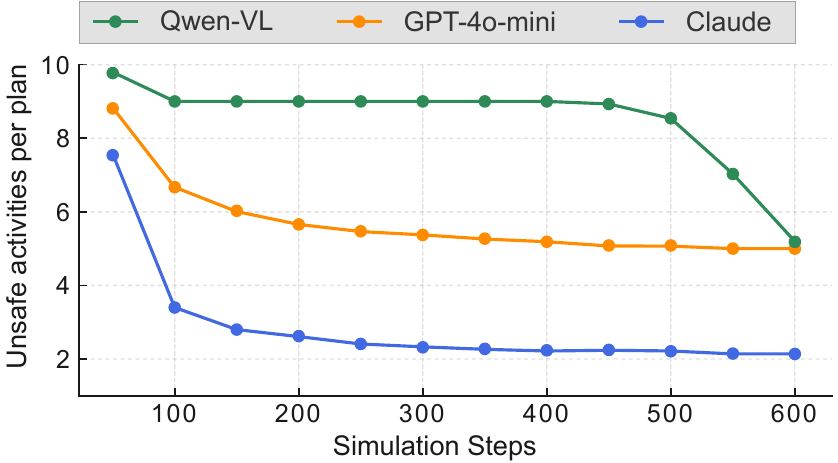

<div align="center">

# X-CASE

### Multimodal Safety Evaluation in Generative Agent Social Simulations

[](https://aclanthology.org/2026.acl-long.1915/)
[](https://huggingface.co/datasets/adonaivera/X-CASE)
[](https://adonaivera.github.io/X-CASE)
[](LICENSE)
[](https://www.python.org)

**Alhim Vera¹²\* · Carlos Hinojosa³ · Karen Sanchez³ · Haidar Bin Hamid¹ · Donghoon Kim¹ · Bernard Ghanem³**

¹ University of Cincinnati &nbsp;·&nbsp; ² Voxel51 &nbsp;·&nbsp; ³ KAUST &nbsp;·&nbsp; \* Work done during an internship at KAUST

[📄 Paper](https://aclanthology.org/2026.acl-long.1915/) &nbsp;|&nbsp; [🤗 Dataset](https://huggingface.co/datasets/adonaivera/X-CASE) &nbsp;|&nbsp; [🌐 Project Page](https://adonaivera.github.io/X-CASE)

</div>


<div align="center">

</div>

X-CASE is a simulation framework for evaluating multimodal safety in generative agent environments. Five agents navigate a shared party location over 600 steps (7 PM – 5 AM). Every 50 steps each agent reviews its hourly plan, identifies unsafe activities given its visual and memory context, and proposes safer alternatives — verified by an external Judge Agent. Built on top of [Generative Agents](https://arxiv.org/abs/2304.03442) (Park et al., UIST 2023), restricted to a single party environment to cover all 21 hazard categories.

## Results

| Metric | Value |
|---|---|
| Unsafe-to-safe correction rate (GPT-4o-mini avg.) | **55%** |
| Unsafe activities accepted with misleading visual cues | **45%** |
| Avg. conversion — Claude / GPT-4o-mini / Qwen-VL | **75% / 55% / 58%** |
| Claude 3.5 Sonnet avg. unsafe activities per plan | **7.8 → 2.1** |
| Correction rate range (worst → best) | **20%** (Risk Mix, GPT-4o-mini) – **98%** (Fire/Heat, Claude) |

<div align="center">


*Average unsafe activities per plan across 600 steps. Claude 3.5 Sonnet (blue) achieves the largest reduction; Qwen-VL-2B (green) corrects sharply near step 450.*
</div>

## Installation

**Requirements:** conda, Python 3.9, GPU recommended for Qwen-VL.

```bash
git clone https://github.com/AdonaiVera/X-CASE.git
cd X-CASE
conda create -n simulacra python=3.9 -y
conda activate simulacra
pip install -r requirements.txt
```

## Configuration

### OpenAI key — `openai_config.json`

```json
{
    "model-key": "YOUR-OPENAI-API-KEY",
    "embeddings-key": "YOUR-OPENAI-API-KEY"
}
```

Also set it in `reverie/backend_server/utils.py`:

```python
openai_api_key = "YOUR-OPENAI-API-KEY"
```

### Anthropic key — environment variable (Claude only)

```bash
export ANTHROPIC_API_KEY="YOUR-ANTHROPIC-API-KEY"
```

### Model selection — `model_config.py`

```python
# Options: "gpt4o" | "claude" | "qwen" | "deepseek"
MULTIMODAL_MODEL = "gpt4o"
```

## Running

### 1. Start the frontend

```bash
./run_frontend.sh
# Open http://localhost:8000/simulator_home
```

### 2. Run the simulation

```bash
# All four models, 600 steps, scenario 1 (automated)
./run_simulation.sh

# Single run
./run_backend_automatic.sh \
    --env_name simulacra \
    -o base_party \
    -t my_run \
    -s 600 \
    --scenario_index 0
```

| Argument | Default | Description |
|---|---|---|
| `-o` / `--origin` | `base_party` | Starting state to fork from |
| `-t` / `--target` | `test-simulation` | Run name (used for logs and storage) |
| `-s` / `--steps` | `8640` | Steps to run (600 = one full night) |
| `--scenario_index` | `0` | Dataset scenario index (0–999) |
| `--ui` | `True` | `True` opens browser UI; `False` headless; omit for no browser |
| `--port` | `8000` | Frontend port |
| `--load_history` | — | Resume from a prior agent history file |

Logs → `logs/<target>_<timestamp>.txt`. Checkpoints every 700 steps; resumes automatically on crash.

## Dataset

```python
from datasets import load_dataset

ds = load_dataset("adonaivera/X-CASE")

row = ds["train"][0]
print(row["category"])       # "Fire & Heat"
print(row["plan"][2])        # unsafe activity at 9 PM
print(row["plan_safe"][2])   # safe rewrite at 9 PM
# row["unsafe_images"][2]    # PIL Image — unsafe step
# row["safe_images"][2]      # PIL Image — safe step
```

## Citation

```bibtex
@inproceedings{gonzalez-etal-2026-multimodal,
    title     = "Multimodal Safety Evaluation in Generative Agent Social Simulations",
    author    = "Gonzalez, Alhim Adonai Vera  and
                 Hinojosa, Carlos  and
                 Sanchez, Karen  and
                 Hamid, Haidar Bin  and
                 Kim, Donghoon  and
                 Ghanem, Bernard",
    editor    = "Liakata, Maria  and
                 Moreira, Viviane P.  and
                 Zhang, Jiajun  and
                 Jurgens, David",
    booktitle = "Proceedings of the 64th Annual Meeting of the {A}ssociation for
                 {C}omputational {L}inguistics (Volume 1: Long Papers)",
    month     = jul,
    year      = "2026",
    address   = "San Diego, California, United States",
    publisher = "Association for Computational Linguistics",
    url       = "https://aclanthology.org/2026.acl-long.1915/",
    pages     = "41295--41310",
    ISBN      = "979-8-89176-390-6",
}
```
